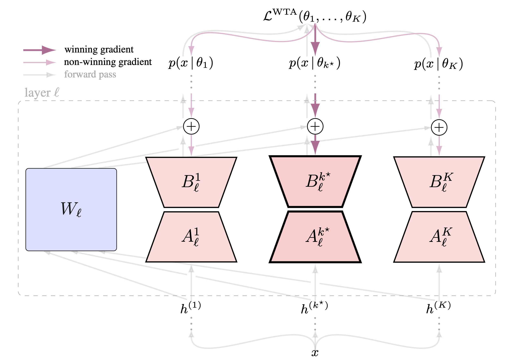
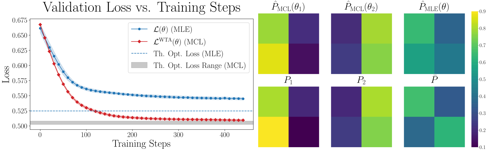

<div align="center">

# Multiple Choice Learning of Low Rank Adapters for Language Modeling

</div>

<div align="center"> <h3> Abstract </h3>  </div>
<div align="justify">

We propose LoRA-MCL, a training scheme that extends next-token prediction in language models with a method designed to decode diverse, plausible sentence continuations at inference time. Traditional language modeling is an intrinsically ill-posed problem: given a context, multiple futures may be equally plausible. Our approach leverages Multiple Choice Learning (MCL) and the Winner-Takes-All loss to efficiently handle ambiguity through Low-Rank Adaptation. We provide a theoretical interpretation of applying MCL to language modeling, assuming the data is generated from a mixture of distributions. To illustrate the proposed approach, we use data sampled from mixtures of Markov chains. We then demonstrate with experiments on visual and audio captioning, as well as machine translation, that our method achieves high diversity and relevance in generated outputs.

</br>


*Overview of LoRA-MCL. A linear layer with LoRA enabled is shown. Frozen base weights are in blue; trainable LoRA adapters are in light red. The forward pass (in gray) is computed independently for each hypothesis. Gradients (purple arrows) are stronger for the winning hypothesis compared to the others.*

## Repository Structure

The repository is organized as follows:

- **General-Purpose LoRA-MCL Wrapper.** The [`peft_mcl/`](peft_mcl) directory provides a general wrapper for applying LoRA-MCL to any Hugging Face model with minimal configuration.

- **Synthetic Data Experiments.** The [`toy/`](toy) directory contains experiments using Mixtures of Markov Chains for synthetic data evaluation.

- **Audio Captioning with Qwen2-Audio.** The [`Qwen2-Audio/`](Qwen2-Audio) directory includes all code related to audio captioning experiments based on Qwen2-Audio.

- **Image Captioning with LLaVA.** To be released soon.

- **Diverse Machine Translation with ALMA.** The [`ALMA/`](ALMA) directory provides code for diverse machine translation experiments with ALMA.

The [`tests/`](tests) directory is used for running tests (not exhaustive).

## 🚀 Quick Start

We provide a general module named `peft_mcl` that is designed to be integrated in any model from the [transformers](https://github.com/huggingface/transformers) library.

> You need a [HuggingFace](https://huggingface.co/) access token for most models. Set it with `export HF_TOKEN=your_token_here` before running the examples.

> The `peft_mcl` module should work with any Hugging Face model from the transformers library with minimal configuration changes.

To use the `peft_mcl` package, first clone the repository and create a conda environment:
```shell
git clone https://github.com/Victorletzelter/LoRA-MCL.git
cd LoRA-MCL
conda create -y -n testenv python=3.10.15
conda activate testenv
pip install -e .
```
See the example below to get started, or run [example_usage.py](example_usage.py) for a demo with dummy data.
```python
from peft_mcl import get_peft_mcl, MCLTrainer, patch_peft_for_mcl
from peft import LoraConfig
import torch
patch_peft_for_mcl(enable=True) # Always run `patch_peft_for_mcl(enable=True)` before using peft_mcl to ensure proper PEFT library patching.
# Standard LoRA configuration
lora_r = 16 # LoRA Rank  
lora_alpha = 16 # LoRA Alpha
lora_dropout = 0.1 # LoRA Dropout (during training)
target_modules = ["q_proj", "k_proj", "v_proj", "down_proj", "up_proj"] # Modules where LoRA is enabled
lora_config = LoraConfig(
    r=lora_r,
    lora_alpha=lora_alpha,
    target_modules=target_modules,
    lora_dropout=lora_dropout,
    task_type="CAUSAL_LM"
)
mcl_params = { # LoRA-MCL related parameters.
  'num_hyps': 3, # Number of hypotheses (K)
  'wta_training_mode' : "relaxed-wta", # "wta", "relaxed-wta" or "annealed-wta"
  'use_group_lora' : False, # For faster training, consider using `use_group_lora=True` which allows parallelization over hypotheses
  'wta_params_epsilon' : 0.05, # \\varepsilon when  wta_training_mode == 'relaxed-wta'
  # Parameters only used if 'wta_training_mode'='annealed-wta':
  'wta_params_ini_temp': 1.0, # initial temperature when 'wta_training_mode'='annealed-wta'
  'wta_params_fin_temp': 1e-6, # final temperature (i.e., temperature from which the mode is switched back to wta) when 'wta_training_mode'='annealed-wta'
  'wta_params_decay_rate': 0.999, # decay rate rho, where temperature(t) = temperature(0)*rho**{t} 
  'wta_params_schedule_mode': "global_step", # type of decay for the temperature, either "global step" if t represents the training step, and "epoch_number" if t is the epoch number
}
loading_kwargs = { # Loading kwargs for the model which are passed to the from_pretrained method.
                "low_cpu_mem_usage": True,
                "torch_dtype": torch.bfloat16}
model_name = "gpt2" # Any HuggingFace model
# MCL Configuration
model = get_peft_mcl(
    model_name_or_path=model_name, # Any HuggingFace model
    lora_config=lora_config,
    **mcl_params
)
```
Training can be performed as:
```python
from transformers import TrainingArguments, Trainer, AutoTokenizer
train_config = TrainingArguments(...) # Define your training arguments
tokenizer = AutoTokenizer.from_pretrained(model_name) # Auto Tokenizer of the pretrained model.
train_dataset = ... # Your training dataset
eval_dataset = ... # Your validation dataset
trainer = MCLTrainer( # Your trainer (MCLTrainer is required if wta_training_mode=annealed-wta, otherwise, the vanilla HF Trainer can be used)
    model=model,
    train_dataset=train_dataset,
    eval_dataset=eval_dataset,
    tokenizer=tokenizer,
    args=train_config,
    data_collator=data_collator,
)
trainer.train() # Launch training
```

Generation can be done with the `generate` method by specifying the hypothesis to evaluate:
```python
import torch
input_ids = ... # Input (tokenized) prompt
hypothesis_idx = 0 # Hypothesis chosen for generation (should be in {0,...,num_hypotheses - 1})
out = model.generate(inputs = input_ids, hypothesis_idx = hypothesis_idx)
```

<details>
<summary><h2>🎲 Synthetic data example</h2></summary>

To reproduce the synthetic data experiments, first go to the toy dir with `cd toy`

### 🔨 Setup

Create a virtual environment with `conda create -y -n synthenv python=3.10.15`. Activate with `conda activate synthenv` and install the required packages with `pip install -r toy/requirements.txt`. 

> LaTeX is enabled plot rendering. Install it with: `sudo apt-get install -y dvipng texlive-latex-extra texlive-fonts-recommended cm-super`.

### 🔄 Training and Visualisation

To reproduce Figure 1 and Figure 4, please run the training with the following commands:
```shell
python train.py experiment=transition1
python train.py experiment=transition2
```
> Please check `transition1.yaml` to see the overriden parameters. You may want to investigate the following parameters in this experiment:
> * `batch_size`: the batch size used.
> * `seq_len`: the sequence length.
> * `N_it`: the number of training iterations.
> * `window_size`: the size of the window in sliding window attention (which is used to improve the convergence of transformers on Markov data)
> * `seed`: the seed used.

The results will be logged in `results/pkl_files` and `results/runs`. More precisely, the runs in the `pkl_files` will be organized as follows:

```shell
└── toy
  └── results
    └── pkl_files
      └── <run_folder_name> # By Default <start_run_time>_<wta_training_mode>_seqlen_<seq_len>_Nit_<Number of iterations>_N_hyps_<number of hypotheses min>_<number of hypotheses max>_seed_<seed>_name_<experiment name>_window_<window_size>_div_rank_<div rank boolean>
        └── config.yaml # config associated with the run
        └── results.pkl # pkl file containing the model weights
        └── training_loss_vs_training_steps.png # (if do_save_plot is True), training loss against training steps (displayed with LaTeX rendering). This corresponds to the curves in Figures 1 and 4 (left).
        └── transition_matrices_comparison_grid_weighted.png # (if do_save_plot is True), 2x3 grid containing the predicted and target matrices at the end of the training. This corresponds to the right subplot in Figures 1 and 4.
        └── transition_matrices_comparison_n_hyps_1_weighted # Folder containing the evolution of the transition matrices (predicted and target, for the 1 hyp model) during training
        └── transition_matrices_comparison_n_hyps_2 # Folder containing the evolution of the transition matrices (predicted and target, for the 2 hyp model) during training
    └── runs
      └── <run_folder_name> # By default, <date>_<start_run_time>_<machine name>, a folder which contains the training tensorboard logs.
```

The generated figure should be as follows (see Figure 1 and 4 from the main paper).


*Comparison of LoRA-MCL with vanilla maximum likelihood estimation (MLE) (Figure 1)*

</details>

<details>
<summary><h2>🎙️ Audio Captioning</h2></summary>

This section is intended for reproducing the results on Audio Captioning. To follow the instruction, please go to the Qwen2-Audio dir with `cd Qwen2-Audio`. This code was tested on Ubuntu 20.04.6.

### 🔨 Setup

#### ⚙️ Environment

If you use conda, you can setup a virtual environment with
```shell
bash setup_env.sh
```
An environment named `qwen_env` will be setup in `Qwen2-Audio/env`. You can then activate it with `PROJECT_DIR="$(pwd) ; source activate $PROJECT_DIR/env`.

> Note that the implementation of LoRA-MCL in Qwen2-Audio was done without using the `peft_mcl`, but instead with a local copy of the transformers library in `Qwen2-Audio/local_transformers`. Although it is not fully tested yet, you can try using the `peft_mcl` by installing `pip install transformers==4.51.0` and setting `use_local_transformers=False` in `conf/model/default.yaml`.

#### ⚙️ Downloads and dataset pre-processing

For the purpose of metrics computation, download metrics-related cache data (~7.6GB) with
```shell
python download/download_cache.py
```
And set your hugging face token with `export HF_TOKEN=...`.

> The preprocessing on AudioCaps and Clotho was done following the pipeline in the [Conette repository](https://github.com/Labbeti/conette-audio-captioning). Note that, unlike Conette (which considers a setup where the audio encoder is frozen and both the spectrogram and embeddings are computed offline — using a CNN in their case), our setup only preprocesses the raw audio, with only the following steps:
> 1) Resampling the audio from 44.1 kHz (Clotho) and 32 kHz (AudioCaps) to 16 kHz. We used 16kHz as target sampling rate to be consistent with the [Whisper](https://proceedings.mlr.press/v202/radford23a/radford23a.pdf) implementation used in [Qwen Audio](https://arxiv.org/pdf/2311.07919).
> 2) If the data contains multiple channels, averaging across channels to obtain a single-channel audio signal, as done in the [Conette](https://github.com/Labbeti/conette-audio-captioning) implementation.
> 3) Packing the data into HDF5 files.

> This is done through `get_resample_mean_raw` function of `Qwen2-Audio/utils/conette/full_conette/conette-audio-captioning/src/conette/transforms/get.py`. We had to implement this function in our cloned Conette repository because, in the Qwen-2-Audio pipeline, the spectrogram computation is done online. 

To download the (preprocessed) Audio Captioning datasets (AudioCaps ~32GB and Clotho-V2 ~11GB), please run:

```shell
python download/download_data.py
```
The datasets will be placed in `Qwen2-Audio/data`.

<details>
<summary><h4>
⚙️(Optional) Reproducing dataset pre-processing </h4></summary>

> We recommend using our preprocessed data rather than reproducing the preprocessing steps, unless you specifically need to modify the preprocessing pipeline.

If you want instead to download your own version of AudioCaps and Clotho and reproduce the steps, the download of the data followed by preprocessing on AudioCaps and Clotho can be done by first installing required packages with `sudo apt install -y openjdk-11-jdk ffmpeg zip && python3 -m pip install -U yt-dlp[default]`. You can then run:
```shell
CONETTE_DIR=LoRA-MCL/Qwen2-Audio/utils/conette/full_conette/conette-audio-captioning
common_args="data.download=true pack_to_hdf=true audio_t=resample_mean_raw post_hdf_name=none pretag=resample_mean_raw data.n_workers=0"
python ${CONETTE_DIR}/src/conette/prepare.py data=audiocaps audio_t.src_sr=32000 ${common_args} # AudioCaps source sampling rate is 32kHz
python ${CONETTE_DIR}/src/conette/prepare.py data=clotho audio_t.src_sr=44100 ${common_args} # Clotho source sampling rate is 44.1kHz
```
These commands will first download the datasets as `.flac` files in `${CONETTE_DIR}/src/conette/data/{DATASET}`. Then, the datasets will be packed into hdf files in `${CONETTE_DIR}/src/conette/data/HDF`. Once the `hdf` files are created, move them to `LoRA-MCL/Qwen2-Audio/data/*` with:
```shell
mv ${CONETTE_DIR}/src/conette/data/HDF/* data/*
```
</details>

### 🔄 Training

To train all LoRA-MLE and LoRA-MCL models (with 5 hypotheses) on audio captioning, run:
```shell
bash train_loop.sh
```
Individual training scripts can be launched with commands of the form:
```shell
bash train_scripts.sh dataset_name num_hyps wta_mode epsilon rank seed use_slurm
```
Where:
* `dataset_name`: dataset name (`audiocaps` or `clotho`)
* `num_hyps`: number of hypotheses
* `wta_mode`: wta training mode (`wta` or `relaxed-wta` or `annealed-wta`).
* `epsilon`: ε parameter when `wta_mode=relaxed-wta`.
* `rank`: LoRA rank.
* `seed`: random seed.
* `use_slurm` whether the scripts should be submitted using slurm.

By default, fine-tuning runs for 10 epochs on Clotho and 1 epoch on AudioCaps, with maximum audio lengths of 30 seconds and 10 seconds, respectively. See `train_script.sh` and the `scripts/` folder for more details.

When launching the trainings, the logs will be saved in `Qwen2-Audio/logs` following the [Hydra](https://github.com/facebookresearch/hydra) template, that is organized as follows:

```shell
└── tsExperiments 
  └── logs
    └── <dataset_name>
        └── <run_folder_name> # By Default: <start_run_time>_<wta_training_mode>_epsilon-<epsilon_value>_<num_hyps>-hyp_rank-<rank>_dataset_name, where start_run_time is in the form %Y-%m-%d_%H-%M-%S
          └── .hydra # Folder to save the config yaml files associated with the run
          └── adapter_model # Folder where the adapters are saved. The latter correspond to the best adapters on the validation set. By default, it contains the folders `lora{k}` for k in {0,...,num_hyps - 1}. Note that when using a Group LoRA architecture (which allow to parallelize over the hypotheses), the parameters of all the adapters are stored in lora0. (TODO: precise better)
          └── events.out.tf.events.*** # A tensorboard event file
```

By default, MLFlow is enabled and will save experiment files in `Qwen2-Audio/logs/mlflow`.

### 🔄 Inference and evaluation

To perform inference, first extract the checkpoint paths with 
```shell
python extract/extract_ckpts.py --log_dir logs
```
A json file `ckpts.json` containing checkpoints paths will then be created in `Qwen2-Audio/`. 

Note that if you want to run inference and evaluation with our own checkpoints, you can download them (~3.45GB) in `Qwen2-Audio/ckpts` with
```shell
python download/download_ckpts.py
```
In this case, run the path extraction script with the correct dir with:
```shell
python extract/extract_ckpts.py --log_dir ckpts
```

You can then create environment variables with the checkpoint paths with:
```shell
python extract/generate_checkpoint_variables.py --input ckpts.json --output checkpoint_vars.sh --format export
. checkpoint_vars.sh
```
Please refer to the generated `checkpoint_vars.sh` for an overview of the created environment variables in the current shell.

You can now run the evaluation script, by defining:
```shell
N_HYPS=5 # number of hypotheses to use for evaluation
DATASET=audiocaps # can be clotho or audiocaps
```
and running:
```shell
bash eval_scripts.sh $N_HYPS $DATASET
```
This script submits a slurm job for each configuration by running a sbatch command through `scripts/qwen_eval.slurm` slurm script. 

The inference includes the following decoding methods for each training scheme: 
* LoRA-MLE with Beam Search (BS), Diverse Beam Search (DBS) decoding, with λ=0.5,0.8,1.0, with Beam sizes B = 5, 10 and 25 (if `lora_mle=True` in the script).
* LoRA-MLE with Test-time augmentation (TTA) and BS decoding with B = 1, 2 and 5 (if `tta=True`).
* LoRA-MoE with BS, DBS decoding, with λ=0.5,0.8,1.0, with B = 5, 10 and 25 (if `tta=True` in the script)..
* LoRA-MCL with BS decoding with B = 1, 2 and 5. This is performed for the relaxed variant if `lora_mcl_relaxed=True` in the script and with the annealed variant if `lora_mcl_annealed=True`.
Note that you can perform sampling-based decoding for each method by setting `do_sampling=True` in the script. 

### 🧪 Metrics computation 

The instructions in the **Inference and Evaluation** section compute evaluation metrics by default  
(if `cfg.do_compute_metrics=True` in `main_hydra.py`).

Metrics computation is performed using the [Conette](https://github.com/Labbeti/conette-audio-captioning/), [AAC-Metrics](https://github.com/Labbeti/aac-metrics) and [COCO-Caption](https://github.com/tylin/coco-caption) libraries.

Custom adaptations of the **AAC-Metrics** library are located in `metrics/aac_metrics_custom/`. These modifications enable **sentence-based oracle metrics computation**, since standard captioning metrics do not support multiple hypotheses.

The computation is performed using the `mh_evaluate` function  (defined in `aac_metrics_custom/functional/evaluate.py`), which is called within the `MH_AllMetrics` class  
(defined in `mh_all_metrics.py`).

Below is a simplified pseudo-code illustrating the computation for each metric *i* (e.g., SPIDEr):

```python
# Let i be the index of a metric (e.g., SPIDEr)
for key in candidates:  # key = '0', ..., f'{n_hypotheses-1}' and each candidate[key] is a List[str].
    # Compute the sentence-based metric for each hypothesis:
    _, outs_sents_i[key] = metric(candidates[key], mult_references) 

# Extract the oracle (best) sentence-level metric for each sentence and compute the average.
mean_oracle_metric_i = extract_oracle_sentence_metrics(
    outs_sents_i=outs_sents_i,           # Sentence-based results per hypothesis
    higher_is_better=higher_is_better_i  # Whether higher values indicate better performance
)
```
The function used to extract oracle scores is defined as follows (simplified for clarity):

```python
def extract_oracle_sentence_metrics(
    outs_sents: Dict[str, Tensor],
    higher_is_better: bool
):
    """
    Extract the oracle-based sentence-level metric from the outs_sents dictionary.

    Args:
        outs_sents: Dictionary containing sentence-level metrics for each hypothesis.
                    Expected keys: '0', '1', ..., 'num_hypotheses-1'.
                    Each outs_sents[key] is a list or tensor of float values.
        higher_is_better: Whether higher metric values indicate better performance.

    Returns:
        The mean oracle sentence-level metric over all evaluation examples.
    """
    N_sentences = len(outs_sents['0']) # Number of examples in the evaluation set

    # Tensor of shape [N_sentences, N_hypotheses]
    metric_values = torch.stack(
        [outs_sents[hypothesis_idx] for hypothesis_idx in outs_sents.keys()],
        dim=1
    )

    # Compute the oracle value for each sentence
    if higher_is_better:
        individual_oracle_sents = torch.max(metric_values, dim=1).values
    else:
        individual_oracle_sents = torch.min(metric_values, dim=1).values

    return torch.mean(individual_oracle_sents).item()
```

### 📊 Results Extraction

The results can be extracted as csv files by running 
```shell
bash extract/extract_results.sh
```
The results will be stored as csv files in `results/saved_csv`.

We provide a script to extract latex tables and plot figures. LaTeX is enabled for plot rendering. Install it with: `sudo apt-get install -y dvipng texlive-latex-extra texlive-fonts-recommended cm-super`. It can be executed with
```python
python extract/extract_metrics_csv.py
```
This will generate a txt file containing the LaTeX command for generating the table with quantitative results in `results/latex`, and a plot displaying the results in `results/figure`.

</details>

<details>
<summary><h2> 🖼️ Image Captioning </h2></summary>

Our image captioning codebase is built upon on the excellent [LLaVA](https://github.com/fe1ixxu/LLaVA) repository. This code was tested with Ubuntu 22.04.

### 🔨 Setup

#### ⚙️ Environment

First go in the LLaVA directory with `cd LLaVA` and create a conda env with
```shell
conda create -n llavaMCL python=3.10 -y
```
Activate it with `conda activate llavaMCL` and install the required packages as follows. Please note that `flash-attn` requires a GPU for installation (we used a H100).
```
pip install --index-url https://download.pytorch.org/whl/cu118 torch==2.1.2 torchvision==0.16.2
pip install flash-attn==2.7.3 --no-build-isolation
pip install -r requirements.txt
sudo apt-get install -y libcusparse-11-8
```

#### ⚙️ Downloads and dataset pre-processing

The TextCaps dataset can be downloaded from the [official](https://textvqa.org/textcaps/download/) website.
You can run
```python
python download_textcaps.py
```
to download (and unzip) the dataset, which will be located in `LLaVA/textcaps`.

The files structure looks as follows.
```shell
└── LLaVA
  └── textcaps
    ├── LLaVA
    ├── train_images/ # unzipped from train_val_images.zip (train and val in the same zip)
    ├── test_images/ # unzipped from test_images.zip
    └── TextCaps_0.1_{train,val,test}.json # annotations files
```

To format the captions of the dataset according to to LLaVA "conversation" format, run:
```shell
python preprocess.py # Ouput will be stored in LLaVA/playground/data/textCaps{Train,Val}.json
```

### 🔄 Training

To launch LoRA-MCL training, go in the LLaVA directory (with `cd LLaVA`) and run (to submit on 4 GPUs for a global batch size of 8):
```shell
export RANK=8
export ALPHA=32
export WTA_MODE=relaxed-wta
export WTA_EPSILON=0.1
export NUM_HYPS=3
bash scripts/v1_5/finetune_task_lora.sh # LoRA-MCL (relaxed, epsilon=0.1, K=3, r=8, alpha=32)
```

For LoRA-MLE training, run (to submit on 4 GPUs for a global batch size of 8):
```shell
export RANK=8
export ALPHA=32
bash scripts/v1_5/finetune_task_lora_single.sh # LoRA-MLE (r=8, alpha=32)
```

For LoRA-MoE training, run (to submit on 4 GPUs for a global batch size of 8):
```shell
export RANK=8
export ALPHA=32
export NUM_EXPERTS=3
bash scripts/v1_5/finetune_task_lora_single_moe.sh # LoRA-MoE (3 experts, r=8, alpha=32)
```

### 🔄 Inference and evaluation

We provide our checkpoints to reproduce the results of the papers. They can be downloaded with
```shell
python download_ckpts.py
```
The organization of the files is as follows:

```shell
└── LLaVA
  └── ckpts
    └── multilingual # Ckpts associated with the Bilingual image captioning experiments (Table 2 of the main paper)
      └── relaxed_2h_01 # LoRA-MCL (relaxed, with epsilon = 0.1), with K = 2 and r = 8
      └── wta_1h_rank16 # LoRA-MLE ckpt, with r = 16
    └── textcaps # Ckpts associated with the quantiative results on TextCaps (Table 3 of the main paper)
      └── 3h_moe # LoRA-MoE, with K = 3
      └── relaxed_3h_01 # LoRA-MCL (relaxed, with epsilon = 0.1), with K = 3
      └── wta_1h_rank8 # LoRA-MLE, with r = 8
      └── wta_1h_rank24 # LoRA-MLE, with r = 24
```
You can then create an environemnt variable associated with each checkpoint path with:
```shell
source create_ckpts_paths.sh
```
The results on Textcaps and then be reproduced by running the following inferences:
```shell
### LoRA-MLE
export CKPT_PATH=${CKPT_TEXTCAPS_WTA_1H_RANK8} # LoRA-MLE with r = 8
export NUM_BOOST=1 # Corresponds to Beam size = 3
bash scripts/v1_5/eval/evalTextCapsSingle.sh # LoRA-MLE (r=8, BS, B=3)
export NUM_BOOST=2 # Corresponds to Beam size = 6
bash LLaVA/scripts/v1_5/eval/evalTextCapsSingle.sh # LoRA-MLE (r=8, BS, B=3)
export CKPT_PATH=${CKPT_TEXTCAPS_WTA_1H_RANK24} # LoRA-MLE with r = 24
export NUM_BOOST=1 # Corresponds to Beam size = 3
bash LLaVA/scripts/v1_5/eval/evalTextCapsSingle.sh # LoRA-MLE (r=24, BS, B=3)
export NUM_BOOST=2 # Corresponds to Beam size = 6
bash LLaVA/scripts/v1_5/eval/evalTextCapsSingle.sh # LoRA-MLE (r=24, BS, B=3)
### LoRA-MoE
export CKPT_PATH=${CKPT_TEXTCAPS_3H_MoE}
export NUM_BOOST=1 # Corresponds to Beam size = 3
bash LLaVA/scripts/v1_5/eval/evalTextCapsSingle.sh # LoRA-MoE (r=8, BS, B=3)
export NUM_BOOST=2 # Corresponds to Beam size = 6
bash LLaVA/scripts/v1_5/eval/evalTextCapsSingle.sh # LoRA-MLE (r=8, BS, B=3)
### LoRA-MCL
export CKPT_PATH=${CKPT_TEXTCAPS_RELAXED_3h_01}
export NUM_BOOST=1 # Corresponds to Beam size = 1
bash LLaVA/scripts/v1_5/eval/evalTextCaps.sh # LoRA-MCL (K=3, r=8, BS, B=1)
export NUM_BOOST=2 # Corresponds to Beam size = 2
bash LLaVA/scripts/v1_5/eval/evalTextCaps.sh # LoRA-MCL (K=3, r=8, BS, B=2)
```

### Bilingual 

The following script translates half of the the TexCaps caption using T5. 
```shell
python LLaVA/translate_textcaps.py
```

The pre-translated captions are in `./playground/data/textCapsTrainTranslatedHalf.json` for the train set and `./playground/data/textCapsTest_answers_translated.jsonl` for the test set.

To train the models on the bilingual setup, you can run the following training scripts:
```shell
### LoRA-MLE
bash scripts/v1_5/finetune_task_lora_single_translated.sh
### LoRA-MCL
bash scripts/v1_5/finetune_task_lora_translated.sh
```

To run inference with our checkpoints, you can run the following script using the environment variables defined above with `source create_ckpts_paths.sh`:
```shell
### LoRA-MCL
export CKPT_PATH=${CKPT_MULTILINGUAL_2H_RELAXED}
bash scripts/v1_5/eval/evalTextCapsSingleTranslated.sh # LoRA-MCL (K=2, r=8, BS, B=1)
### LoRA-MLE
export CKPT_PATH=${CKPT_MULTILINGUAL}
bash scripts/v1_5/eval/evalTextCapsTranslated.sh # LoRA-MCL (K=1, r=16, BS, B=2)
```

</details>

<details>
<summary><h2> 🌐 Diverse Machine Translation </h2></summary>

This section provides instructions for reproducing the results on Machine Translation. To follow the steps, navigate to the MT directory with `cd ALMA`. The codebase is built upon the excellent [ALMA](https://github.com/fe1ixxu/ALMA) repository. This code was tested with Ubuntu 22.04.

### 🔨 Setup

Create an environment with
```shell
conda create -n alma python=3.11
conda activate alma
```
And install the required packages:
```shell
bash install_alma.sh
```

### 🔄 Training

To launch the fine-tuning, both for a one hypothesis model and for a 3-hypotheses model, please run:
```shell
bash train_1h.sh # For the 1-hypothesis model with rank 16 and 48
bash train_3h.sh # For the 3-hypotheses model with rank 16.
```

The logs will be written in `logs` and will have the following structure:

```shell
└── logs
  └── ${N_HYPS}h_rank_${RANK} # Logs associated with the N_HYPS hypotheses with rank $RANK.
    └── best_ckpt # Best checkpoint according to the validation loss
    └── checkpoint-X # Other checkpoint stored during training at step / epoch X.
    └── tensorboard # Folder with tensorboard logs.
```

### 🔄 Inference and metrics computation

Once the trainings have finished, you can run the inference and metrics computation with:
```shell
CKPT_FOLDER=logs
bash eval_1h.sh $CKPT_FOLDER # For the 1-hypothesis model with rank 16 and 48
bash eval_3h.sh $CKPT_FOLDER # For the 3-hypotheses model with rank 16.
```

This will generate an additional folder in the above structure, containing the predictions as well as metrics, computed over the full test dataset (when the number of test samples is -1, as explained below).

```shell
└── logs
  └── ${N_HYPS}h_rank_${RANK} # Logs associated with the N_HYPS hypotheses with rank $RANK.
    └── ...
    └── ${DATASET}-${N_TEST}samples-NR${NR} # Outputs when testing on $DATASET, with N_TEST samples for evaluation and setting num_return_sequences=${NR} for generation (num_return_sequences=1 for multi-hypotheses models). If N_TEST=-1, evaluation is performed on the full dataset.
      └── ${DATASET}-${N_TEST}samples-B${BEAM}_Div${DIV_PEN}_NR${NR}_test.yaml # yaml file with the metrics when using beam size = ${BEAM}, diversity_penalty=${DIV_PEN}, num_return_sequences=${NR}
      └── ${DATASET}-${N_TEST}samples-B${BEAM}_Div${DIV_PEN}_NR${NR}_test.pkl # pkl file containing the predictions (same syntax as above otherwise)
      └── ${DATASET}-${N_TEST}samples-B${BEAM}_Div${DIV_PEN}-NR${NR}.txt # txt file containing the predictions (same syntax as above otherwise)
```

To run inference and evaluation with our checkpoints, first download the adapter weights (~542MB) with
```shell
python download/download_ckpts.py
```
Then run the above commands with CKPT_FOLDER=ckpts instead: 
```shell
CKPT_FOLDER=ckpts
bash eval_1h.sh $CKPT_FOLDER # For the 1-hypothesis model with rank 16 and 48
bash eval_3h.sh $CKPT_FOLDER # For the 3-hypotheses model with rank 16.
```

### 📊 Results Extraction

To extract the results, first install latex: `sudo apt-get install -y dvipng texlive-latex-extra texlive-fonts-recommended cm-super` and run:
```shell
python extract_results.py
```
This will write a txt file containing the latex table, as well as the Figure displaying the results in the (Diversity, Quality) plane (in `png` and `pdf` format) in `results/`.

</details>

### 🙏 Acknowledgments

This work was funded by the French Association for Technological Research (ANRT CIFRE contract 2022-1854) and the LISTEN Laboratory of Télécom Paris. It also benefited from access to the HPC resources of IDRIS (allocation 2024-AD011014345) by GENCI.

This repository contains source code adapted from the following Github repositories, for which we greatly thank the authors:

[pytorch-lightning](https://github.com/Lightning-AI/pytorch-lightning/blob/master/LICENSE) (under Apache 2.0 License)

[Hydra](https://github.com/facebookresearch/hydra) (under MIT License)

[Qwen-Audio](https://github.com/QwenLM/Qwen-Audio) and [Qwen2-Audio](https://github.com/QwenLM/Qwen2-Audio)

[transformers](https://github.com/huggingface/transformers) (under Apache 2.0) and [peft](https://github.com/huggingface/peft/tree/main) (under Apache 2.0)

[Conette](https://github.com/Labbeti/conette-audio-captioning) (which is adapted in `Qwen2-Audio/utils/conette/full_conette/conette-audio-captioning/`) and [aac-metrics](https://github.com/Labbeti/aac-metrics) (under MIT License)

[CocoCaption](https://github.com/tylin/coco-caption) (under BSD License)

[LLaVA](https://github.com/haotian-liu/LLaVA) (which is adapted in `llava16/`) (under Apache 2.0)

[TextCaps](https://github.com/facebookresearch/mmf/tree/project/m4c/projects/M4C_Captioner) from [MMF](https://github.com/facebookresearch/mmf/tree/project/m4c) under BSD License.

[ALMA](https://github.com/fe1ixxu/ALMA) (which is adapted in `ALMA/`) under MIT License.

[fairseq](https://github.com/facebookresearch/fairseq) under MIT License.

[analyzing-uncertainty-nmt](https://github.com/facebookresearch/analyzing-uncertainty-nmt) under CC BY-NC 4.0 License.

### 📝 Citation

If our work helped in your research, feel free to give us a star ⭐ or to cite us with the following bibtex code:

```bibtex
@article{loramcl,
  title={Multiple Choice Learning of Low Rank Adapters for Language Modeling},
  author={Letzelter, Victor and Malard, Hugo and Fontaine, Mathieu and Richard, Ga{\"e}l and Essid, Slim and Bursuc, Andrei and P{\'e}rez, Patrick},
  journal={arXiv preprint arXiv:2507.10419},
  year={2025}
}
```